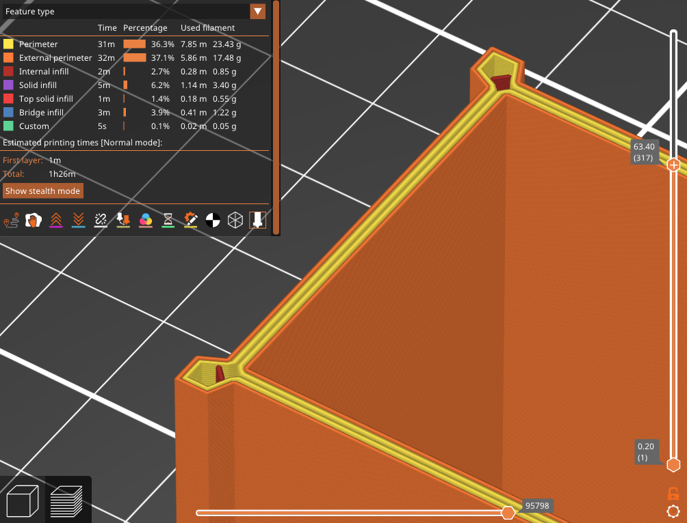
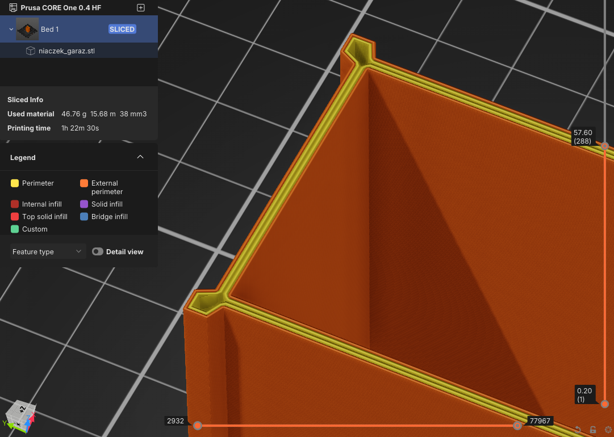

# Short extrusion filter — a PrusaSlicer slicing plugin

A `slicing.extrusion_filter` plugin for PrusaSlicer 3.x. It drops extrusions too short to
be worth the travel that reaches them.

## The problem

A fill pattern clipped against a contour leaves stubs behind. In a corner where the grid
meets the wall at a shallow angle, an infill line survives for about a millimetre. An
internal perimeter squeezed between two features comes out as a sliver.

The stub itself contributes nothing. What it costs is a travel to reach it, a retraction,
the extrusion, another retraction and a travel away — and on a tall part with four such
corners, that repeats on every single layer.

On the test model, 1704 of 1769 internal infill runs were shorter than 2 mm. Together they
laid down 2.2 m of material and caused 76 m of head movement.



The two dark stubs in the corners are what internal infill amounts to on a part like this
one — the legend puts the whole of it at 2.7 % of the print time for 0.28 m of filament.
They are there because the grid meets the wall at a shallow angle, and they come back on
every layer of the wall.

## What this does

The slicer asks the plugin about every perimeter and infill path *before* travels and
seams are decided, so a rejected path disappears together with the movement that would
have reached it — and the paths that remain get routed as if it had never existed. That
second part matters: most of the saving comes not from skipping the detour but from the
infill traversal being re-optimised once the stubs are gone.



Same corners, same walls, no stubs. The slicer's own estimate for that model drops from
1 h 26 m to 1 h 22 m 30 s — a different garage from the one measured below, and a smaller
saving than the table shows, which is what a shorter and simpler part looks like.

Roles are handled by an **allowlist**. Only `Perimeter` (internal perimeters),
`InternalInfill` and `SolidInfill` are ever considered; everything else is kept by
construction, so the external perimeter, the top surface, bridges, gap fill, supports and
the skirt are out of reach and stay out of reach when a future slicer version adds a role.

## Measurements

Test model: a garage, Prusa Core One 0.4 nozzle, 0.2 mm layers, 15 % grid infill, 2
perimeters. Threshold 2 mm, first layer protected.

| | baseline | filtered | |
|---|---|---|---|
| travel | 84 748 mm | 8 666 mm | **−89.8 %** |
| retractions | 1 917 | 221 | **−88.5 %** |
| extrusion | 408 443 mm | 406 254 mm | −0.5 % |
| print time | 137.6 min | 126.9 min | **−7.8 %** |

1 720 of 4 161 extrusions dropped, for 0.5 % less material.

Per role, so it is clear what was and was not touched:

| role | baseline runs / mm | filtered runs / mm |
|---|---|---|
| External perimeter | 889 / 173 110 | 889 / 173 110 |
| Perimeter | 889 / 172 727 | 889 / 172 727 |
| Top solid infill | 425 / 5 862 | 425 / 5 862 |
| Bridge infill | 2 / 9 064 | 2 / 9 064 |
| Internal infill | 1 769 / 7 175 | 65 / 5 002 |
| Solid infill | 182 / 40 461 | 171 / 40 445 |

Top solid infill holds nine runs under 2 mm of its own; they survived, which is the
allowlist doing its job.

## Settings

`settings.lua` sits next to the plugin. Edit it and re-slice — no restart, no rescan.

| key | default | meaning |
|---|---|---|
| `min_length` | `2.0` | An extrusion shorter than this, in mm, is dropped. |
| `min_length_by_role` | `{}` | Per role overrides of `min_length`. |
| `filtered_roles` | `Perimeter`, `InternalInfill`, `SolidInfill` | The only roles the filter may touch. |
| `first_filtered_layer` | `1` | Layers below this index are never filtered; they carry the bed adhesion. |

## Choosing a threshold

Below roughly three or four nozzle diameters a segment adds almost nothing to the part,
while the travel and the two retractions around it cost real time. 2 mm on a 0.4 mm nozzle
is a conservative starting point. Raise it while watching the extrusion total: as long as
the material removed stays a fraction of a percent, the stubs really were noise.

Be stricter with `SolidInfill` than with `InternalInfill` — solid regions carry load and
sit under top surfaces, so removing pieces of them is more visible.

## Requirements

A PrusaSlicer build that provides the `slicing.extrusion_filter` plugin API. See
`doc/Plugin_API.md` in the slicer sources for the API contract.

## Installing

Symlink or copy the bundle directory into the slicer's plugin directory. The directory
name has to match the `id` in `manifest.json`.

```bash
ln -s "$PWD/com.github.dzwiedziu-nkg.short-extrusion" ~/.config/PrusaSlicer/lua/
```

The plugin has no menu entry — it is not user invoked. The log names it at the start of
every export and reports what it removed at the end:

```
[info] Extrusion filter plugin in use: com.github.dzwiedziu-nkg.short-extrusion.short_extrusion
[info] Extrusion filter plugin ... dropped 1720 of 4161 extrusions
```

To turn it off, remove the bundle from the plugin directory.

## Measuring

`tools/runs.py <gcode> [threshold]` groups a G-code file into extrusion runs — maximal
sequences of extruding moves not interrupted by a travel — and reports, per `;TYPE:`
label, how many fall below the threshold and how much material they represent. It is how
the tables above were produced, and it is model independent.

`tools/travel.py <gcode>` sums the non-extruding moves.

## Limitations

- The plugin sees one path at a time and cannot tell that two stubs it is dropping were
  the only thing anchoring a region.
- Dropping infill reduces material, so at aggressive thresholds it will eventually show up
  in part strength. The default is deliberately conservative.
- A short path is judged by its own length only; a 1.5 mm stub in the middle of dense
  infill, with nothing to travel for, is dropped just like an isolated one. It costs
  nothing to keep such a path, so a future version could weigh the travel it actually
  saves.

## License

AGPL-3.0-only, the same licence as PrusaSlicer itself. The full text is in `LICENSE`.
